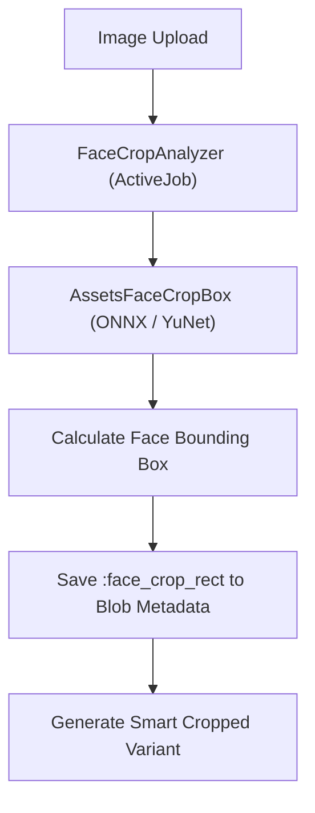

Hello everyone! Today we are going to tackle a classic web development problem: **avatar cropping**.

When users upload profile photos or portrait images, standard image processing pipelines typically crop directly from the geometric center (resize_to_fill). If a user uploads a full-body photo or an off-center portrait, this naive central cropping often turns them into the Headless Horseman of your UI—truncating faces awkwardly at the chest, chin, or forehead.

Traditionally, solving this in Rails required shipping uploads to external cloud APIs (like [AWS Rekognition](https://aws.amazon.com/rekognition/), [GCP Cloud Vision](https://docs.cloud.google.com/vision/docs/detecting-faces)) or running sidecar Python microservices hosting heavy PyTorch pipelines (which inevitably demand their own dedicated DevOps team just to keep pip dependencies from fighting each other). Both approaches introduce network latency, vendor lock-in, infrastructure complexity, and recurring costs.

In this article, we will build a **100% in-process, pure Ruby & ONNX solution** for smart face-aware image cropping using **YuNet**, **ONNX Runtime**, **Numo::NArray**, and **ActiveStorage with ruby-vips**.

## Why YuNet?

**YuNet** is an ultra-lightweight, anchor-free face detection model developed as part of the OpenCV model zoo.

- **Multi-Scale Detection:** It utilizes feature pyramid networks across 3 spatial strides (`8`, `16`, and `32` pixels), allowing it to detect faces ranging from tiny background figures to large macro close-ups.
- **Microservice-Free Size:** Weighing in at under **2 MB**, YuNet achieves high average precision on benchmark datasets while running blazingly fast on standard server CPUs.
- **Rich Output:** In addition to bounding boxes, it predicts facial keypoints and objectness confidence scores.

### How YuNet Compares to Other Vision Models

When picking a local face detection model for a server environment, you generally have a few popular alternatives, but each comes with specific tradeoffs:

* **Haar Cascades (Legacy OpenCV):** The old-school approach. Extremely fast, but highly inaccurate by modern standards. It struggles with side profiles, poor lighting, and non-frontal faces.
* **MTCNN (Multi-task Cascaded Convolutional Networks):** A historically popular deep learning approach. However, it relies on a cascade of three separate neural networks (P-Net, R-Net, O-Net). Running three sequential inferences on a CPU is computationally expensive and slow compared to a single-pass model.
* **BlazeFace (Google MediaPipe):** Blazingly fast, but heavily optimized for mobile phone camera framing (selfies and close-ups). It often struggles to detect smaller faces further away in the background.
* **RetinaFace:** A heavy-duty, highly accurate model (often paired with ResNet or MobileNet backbones). While excellent for complex facial recognition, 3D alignment, or dense landmark mapping, it is significantly larger and far more computationally expensive on a CPU. It is total overkill for calculating a simple 2D cropping box.
* **YuNet:** The perfect "Goldilocks" model. Because it is anchor-free and uses a Feature Pyramid Network across multiple strides, it detects both tiny background faces and massive close-ups in a single pass. At under 2MB, it requires minimal RAM and runs effortlessly on standard Ruby web server CPUs without dedicated GPUs.

**Model Comparison Summary:**

| Model             | Size / Weight   | CPU Speed              | Accuracy & Robustness | Primary Drawback for Avatar Cropping                           |
|-------------------|-----------------|------------------------|-----------------------|----------------------------------------------------------------|
| **Haar Cascades** | Very Small      | Fast                   | Low                   | Terrible with non-frontal faces and poor lighting.             |
| **MTCNN**         | Medium          | Slow                   | Good                  | High CPU overhead due to 3-pass cascade architecture.          |
| **BlazeFace**     | Tiny            | Very Fast              | Moderate              | Struggles to detect smaller, distant faces in full-body shots. |
| **RetinaFace**    | Large           | Slow                   | Excellent             | Computationally expensive; overkill for a simple bounding box. |
| **YuNet**         | **Tiny (~2MB)** | **Fast (Single-pass)** | **High**              | **None (The optimal balance of speed, size, and precision).**  |

### Why `face_detection_yunet_2026may.onnx`?

You might notice we are loading a specific `2026may` version of the model. Machine learning models decay over time as frameworks update their operation sets, but more importantly, this specific ONNX compilation was re-exported with **dynamic input shapes (symbolic dimensions)**.

Older vision models often hardcode static resolution requirements (expecting exactly 320x320 or 640x640 pixels), which forces you to stretch, distort, or aggressively crop your image *before* the model even sees it. By replacing static constraints with symbolic height and width dimensions, this 2026 update allows us to run inference on virtually any image resolution natively—as long as we pad it to a multiple of 32 to satisfy the stride math. Furthermore, it ensures absolute compatibility with the latest OpenCV 5.x ONNX Runtime engines, preventing those dreaded deprecated node errors when you update your gems.

## Why ONNX Runtime & Numo::NArray?

Instead of invoking Python sub-processes, we execute the model directly inside Ruby memory:

- **`onnxruntime`:** Ruby bindings for Microsoft's high-performance C++ ONNX Runtime engine. It executes pre-trained `.onnx` models with hardware acceleration.
- **`numo-narray`:** Ruby's answer to NumPy. It delivers fast multidimensional array manipulation in C, enabling us to transform raw image byte buffers into 4D tensor structures (`1 × 3 × H × W`) required by deep learning backbones.

## System Architecture

Our smart cropping system integrates directly into the standard ActiveStorage lifecycle using custom analyzers and model concerns.



Here is how the data flows:

1. When an image is attached, ActiveStorage schedules our `FaceCropAnalyzer`.
2. The analyzer passes a `Vips::Image` handle to `AssetsFaceCropBox`.
3. `AssetsFaceCropBox` resizes the image, converts raw pixel bytes into a `Numo::SFloat` NCHW tensor, runs YuNet inference via `OnnxRuntime::Model`, and extracts the highest-confidence face box.
4. The coordinates are written to the `active_storage_blobs.metadata` JSON payload.
5. Models equipped with our `FaceCroppableAttachments` concern inspect the blob metadata and apply precise Vips `crop` operations before resizing variants.

## Installation & Setup

Add the native ML and array manipulation gems to your `Gemfile`:

```ruby
# Gemfile

# Face detection ONNX model runner
gem 'onnxruntime'

# Fast multidimensional matrix/array calculations
gem 'numo-narray'

```

Run `bundle install`. Download the official [face_detection_yunet_2026may.onnx](/assets/images/rails/face_detection_yunet_2026may.onnx) model file and place it inside your application tree (e.g., `lib/assets/models/vision/face_detection_yunet_2026may.onnx`).

## The Core Vision Pipeline (`AssetsFaceCropBox`)

The `AssetsFaceCropBox` class handles image pre-processing, memory layout conversion, model invocation, and spatial decoding.

```ruby
# frozen_string_literal: true

class AssetsFaceCropBox
  # Model & Threshold Configs
  FACE_THRESHOLD = 0.6
  YUNNET_IMAGE_PADDING = 32
  FACE_PADDING_PERCENTAGE = 0.3

  # Tensor Dimensions
  BATCH_SIZE = 1
  RGB_CHANNELS = 3

  # Minimum size to run inference (saves CPU on tiny placeholder images)
  MIN_IMAGE_DIMENSION = 32
  # Prevent memory exhaustion (OOM) on massive images
  MAX_IMAGE_DIMENSION = 4096

  # YuNet Architecture Settings
  MODEL_STRIDES = [8, 16, 32].freeze
  PRIMARY_VALUE_INDEX = 0

  # Normalization & Math Constraints
  MIN_PROBABILITY = 0.0
  MAX_PROBABILITY = 1.0
  PADDING_BOTH_SIDES_FACTOR = 2 # Applies padding to both sides (e.g., left + right)
  HALF_FACTOR = 2.0             # Used for centering offsets (radius / half-width)

  @model_mutex = Mutex.new

  class << self
    def call(vips_image)
      # Early return for images that are too small to contain a face
      return nil if vips_image.width < MIN_IMAGE_DIMENSION || vips_image.height < MIN_IMAGE_DIMENSION

      # Convert grayscale images (1 or 2 bands) to standard sRGB (which has 3 bands)
      vips_image = vips_image.colourspace(:srgb) if vips_image.bands < 3
      # Drop the alpha channel if the image happens to be RGBA
      vips_image = vips_image.extract_band(0, n: 3) if vips_image.bands > 3

      # Dynamic Scaling for ML Inference
      scale = 1.0
      ml_image = vips_image

      if vips_image.width > MAX_IMAGE_DIMENSION || vips_image.height > MAX_IMAGE_DIMENSION
        # Calculate how much to shrink it (e.g., scale = 0.5 for an 8192px image)
        scale = MAX_IMAGE_DIMENSION.to_f / [vips_image.width, vips_image.height].max
        ml_image = vips_image.resize(scale)
      end

      padded_image = model_padded_image(ml_image)

      # Convert to NCHW Tensor
      nchw_tensor = nchw_tensor(padded_image)

      # Inference
      input_name = onnx_model.inputs[0][:name]
      result = onnx_model.predict({ input_name => nchw_tensor })

      # Clean up tensor reference
      nchw_tensor = nil

      # Find Best Face
      best_score, best_bbox, best_stride, best_grid_x, best_grid_y = find_best_face(padded_image, result)

      # Clean up intermediate structures
      padded_image = nil
      result = nil

      # Return nil if no face is found above our confidence threshold
      return nil if best_score < FACE_THRESHOLD

      crop_rect = calculate_face_box(vips_image:, best_bbox:, best_stride:, best_grid_x:, best_grid_y:)

      # Map coordinates back to the original high-resolution image space
      if scale < 1.0
        inverse_scale = 1.0 / scale
        crop_rect = crop_rect.map { |val| (val * inverse_scale).round }
      end

      crop_rect
    end

    private

    def model_padded_image(img)
      pad_w = (YUNNET_IMAGE_PADDING - (img.width % YUNNET_IMAGE_PADDING)) % YUNNET_IMAGE_PADDING
      pad_h = (YUNNET_IMAGE_PADDING - (img.height % YUNNET_IMAGE_PADDING)) % YUNNET_IMAGE_PADDING
      img.embed(
        0,
        0,
        img.width + pad_w,
        img.height + pad_h,
        extend: :black
      )
    end

    def nchw_tensor(img)
      bytes = img.write_to_memory
      shape = [img.height, img.width, img.bands]

      narray_img = Numo::UInt8.from_binary(bytes, shape)
      bytes = nil # Free raw string immediately

      # Transform HWC (Height, Width, Channel) -> NCHW (Batch, Channel, Height, Width)
      narray_img.cast_to(Numo::SFloat).transpose(
        2, 0, 1
      ).reshape(
        BATCH_SIZE, RGB_CHANNELS, img.height, img.width
      )
    end

    def find_best_face(padded_image, result)
      best_score = -1.0
      best_bbox = nil
      best_stride = nil
      best_grid_x = nil
      best_grid_y = nil

      MODEL_STRIDES.each do |stride|
        cls_data = result["cls_#{stride}"].first
        obj_data = result["obj_#{stride}"].first
        bbox_data = result["bbox_#{stride}"].first

        feature_w = (padded_image.width.to_f / stride).ceil

        cls_data.each_with_index do |cls_arr, idx|
          cls = cls_arr[PRIMARY_VALUE_INDEX].clamp(MIN_PROBABILITY, MAX_PROBABILITY)
          obj = obj_data[idx][PRIMARY_VALUE_INDEX].clamp(MIN_PROBABILITY, MAX_PROBABILITY)
          score = Math.sqrt(cls * obj)

          next unless score > best_score

          best_score = score
          best_bbox = bbox_data[idx]
          best_stride = stride
          best_grid_y = idx / feature_w
          best_grid_x = idx % feature_w
        end
      end

      [best_score, best_bbox, best_stride, best_grid_x, best_grid_y]
    end

    def calculate_face_box(vips_image:, best_bbox:, best_stride:, best_grid_x:, best_grid_y:)
      # Decode Coordinates
      face_cx = (best_grid_x + best_bbox[0]) * best_stride
      face_cy = (best_grid_y + best_bbox[1]) * best_stride
      face_w  = Math.exp(best_bbox[2]) * best_stride
      face_h  = Math.exp(best_bbox[3]) * best_stride

      # Calculate Tight Square Crop Area with Padding
      face_max_dim = [face_w, face_h].max
      target_size = face_max_dim * (1.0 + (FACE_PADDING_PERCENTAGE * PADDING_BOTH_SIDES_FACTOR))
      crop_size = [target_size, vips_image.width, vips_image.height].min

      crop_x = face_cx - (crop_size / HALF_FACTOR)
      crop_x = crop_x.clamp(0, vips_image.width - crop_size)

      crop_y = face_cy - (crop_size / HALF_FACTOR)
      crop_y = crop_y.clamp(0, vips_image.width - crop_size)

      # ActiveStorage image_processing expects: [left, top, width, height]
      [crop_x.round, crop_y.round, crop_size.round, crop_size.round]
    end

    # Cache model instance with thread safety
    def onnx_model
      return @onnx_model if @onnx_model

      @model_mutex.synchronize do
        @onnx_model ||= OnnxRuntime::Model.new(
          Rails.root.join("lib/assets/models/vision/face_detection_yunet_2026may.onnx").to_s
        )
      end
    end
  end
end

```

### Deep Dive into the Pipeline and Spatial Math

To truly understand how this pipeline works without relying on Python, let's break down the core constants and complex methods in our `AssetsFaceCropBox` class:

#### CPU & Memory Guardrails

Running machine learning models against raw `8K` or `12K` camera uploads can instantly trigger Out-Of-Memory (OOM) fatal crashes. We scale large images down to a maximum boundary (`MAX_IMAGE_DIMENSION = 4096`) before inference. If a downscale occurs, we calculate the inverse scale factor and map the final bounding box coordinates back to the original high-resolution space at the very end.

#### `model_padded_image(img)`: Padding for Stride Alignment

Deep learning models that utilize convolutional strides (like YuNet's 32-pixel maximum stride) require input tensors whose dimensions are perfectly divisible by that maximum stride. If you pass an image that is 300x300 pixels, the math deep inside the network breaks.

```ruby
pad_w = (YUNNET_IMAGE_PADDING - (img.width % YUNNET_IMAGE_PADDING)) % YUNNET_IMAGE_PADDING

```

This modulo arithmetic calculates exactly how many pixels we need to add to the right and bottom edges to reach the nearest multiple of 32. For a 300px width, `300 % 32 = 12`. We need `32 - 12 = 20` pixels of padding. The outer `% 32` handles the edge case where the image is *already* perfectly divisible by 32 (resulting in 0 instead of 32). We then use `vips_image.embed` to attach this black border dynamically.

#### `nchw_tensor(img)`: Memory Layout Conversion

Ruby strings and Vips represent images as **HWC** (Height, Width, Channels) using unsigned 8-bit integers (`UInt8`). ONNX models, however, expect data formatted as **NCHW** (Batch Size, Channels, Height, Width) using 32-bit floats (`SFloat`).

```ruby
narray_img.cast_to(Numo::SFloat).transpose(2, 0, 1).reshape(BATCH_SIZE, RGB_CHANNELS, img.height, img.width)

```

Using `Numo::NArray` allows us to restructure this memory instantly in C, bypassing slow Ruby `each` loops.

* `cast_to(Numo::SFloat)` converts the 0-255 RGB integers into decimal floats.
* `transpose(2, 0, 1)` mathematically shifts the 3rd dimension (Channels) to the front, changing HWC to CHW.
* `reshape(...)` adds the Batch Size dimension to the very front, completing the NCHW tensor requirement.

#### `find_best_face(padded_image, result)`: Decoding the Feature Pyramid & `FACE_THRESHOLD`

YuNet evaluates the image at three different scales (Strides: 8, 16, 32) simultaneously.

* **Stride 8** slices the image into a dense grid of tiny cells to find small background faces.
* **Stride 32** slices the image into a coarse grid of large cells to find massive close-up faces.

The model returns raw arrays containing `cls` (classification probability: is this a face?) and `obj` (objectness probability: is the bounding box accurate?).

```ruby
score = Math.sqrt(cls * obj)
```

We combine these two probabilities using a geometric mean (`Math.sqrt`) to get a strict overall confidence score. We iterate through every cell on the spatial grid (`idx % feature_w` gives us the X grid coordinate, `idx / feature_w` gives us the Y grid coordinate) across all three strides, continuously overwriting `best_score` and `best_bbox` until we isolate the single most confident face in the entire image.

If the highest score across the image fails to meet our `FACE_THRESHOLD = 0.6` (meaning the model is less than `60%` confident it found a face), the script gracefully aborts returning `nil`, and the application falls back to a standard center crop. This prevents cropping random textures that vaguely resemble a face.

#### Geometric Calculation & `FACE_PADDING_PERCENTAGE`

Once the best bounding box is selected, the predicted center coordinates `(cx, cy)` and logarithmic dimensions `(w, h)` are scaled back by the current stride.

```ruby
target_size = face_max_dim * (1.0 + (FACE_PADDING_PERCENTAGE * PADDING_BOTH_SIDES_FACTOR))
```

Machine learning models draw bounding boxes tightly around the structural facial features (eyes, nose, mouth, chin). If you crop strictly to this box, the avatar looks claustrophobic and unnatural. We apply `FACE_PADDING_PERCENTAGE = 0.3` to expand the crop area by `30%` on all sides. This incorporates natural head clearance, hair, and shoulders, ensuring the final avatar feels professionally framed rather than awkwardly zoomed in on a user's nose.

## Hooking into ActiveStorage (`FaceCropAnalyzer`)

ActiveStorage runs analyzers in background jobs whenever blobs are created. We extend `ActiveStorage::Analyzer::ImageAnalyzer::Vips` to run YuNet detection during asset metadata extraction.

```ruby
# frozen_string_literal: true

class FaceCropAnalyzer < ActiveStorage::Analyzer::ImageAnalyzer::Vips
  def self.accept?(blob)
    return false unless super

    # Only process attachments explicitly designated as face croppable
    blob.attachments.pluck(:record_type, :name).any? do |record_type, name|
      record_class = record_type.safe_constantize

      record_class.respond_to?(:face_croppable_attachments) &&
        record_class.face_croppable_attachments.include?(name)
    end
  end

  def metadata
    base_metadata = super

    if base_metadata[:face_crop_rect].blank? && base_metadata[:face_detection_run].blank?
      read_image do |image|
        crop_rect = AssetsFaceCropBox.call(image)
        base_metadata[:face_crop_rect] = crop_rect if crop_rect.present?
      rescue StandardError => e
        Rails.logger.error("[FaceCropAnalyzer] Failed to process image: #{e.message}")
      ensure
        # Always mark detection as run to avoid redundant re-analysis loops
        base_metadata[:face_detection_run] = true
      end
    end

    base_metadata
  end
end

```

Make sure to register the custom analyzer in your application configuration:

```ruby
# config/application.rb
config.active_storage.analyzers.prepend FaceCropAnalyzer

```

#### Why `prepend` instead of `append`?

You must use `config.active_storage.analyzers.prepend FaceCropAnalyzer` instead of simply appending it to the array.

When ActiveStorage analyzes a newly attached file, it iterates through its configured array of analyzers and calls the `.accept?(blob)` method on each one. It stops at the very first analyzer that returns `true`.

If we appended our analyzer to the end of the list, the default `ActiveStorage::Analyzer::ImageAnalyzer::Vips` would inspect the image, happily slap an "LGTM" on the blob by returning `true`, and consume the job entirely. Our custom face detection logic would never execute. By prepending it, we ensure our analyzer gets the first look at the file.

## Model DSL Concern (`FaceCroppableAttachments`)

To make model attachments face-aware, we create a reusable concern that adds a dynamic variant generator helper.

```ruby
# frozen_string_literal: true

module FaceCroppableAttachments
  extend ActiveSupport::Concern

  SAVER_OPTIONS = {
    strip: true,
    lossless: false,
    quality: 95
  }.freeze

  included do
    class_attribute :face_croppable_attachments, default: []
  end

  class_methods do
    def generates_face_cropped_headshot(attachment_name)
      self.face_croppable_attachments |= [attachment_name.to_s]

      define_method("#{attachment_name}_headshot") do |format: :webp, size: 300|
        attachment = public_send(attachment_name)
        return nil unless attachment.attached?

        metadata = attachment.blob.metadata

        # Fallback to standard center crop if analyzer hasn't processed the blob yet
        unless metadata[:face_detection_run]
          return attachment.variant(
            format: format,
            resize_to_fill: [size, size],
            saver: SAVER_OPTIONS
          )
        end

        transformations = {
          format: format,
          saver: SAVER_OPTIONS
        }

        # Apply crop rectangle if a face was detected; otherwise fallback to center fill
        if metadata[:face_crop_rect].present?
          transformations[:crop] = metadata[:face_crop_rect]
          transformations[:resize_to_limit] = [size, size]
        else
          transformations[:resize_to_fill] = [size, size]
        end

        attachment.variant(transformations)
      end
    end
  end
end

```

## Putting It All Together in Models and Views

Include `FaceCroppableAttachments` in your ActiveRecord models and declare which attachments should use face detection:

```ruby
# app/models/user.rb
class User < ApplicationRecord
  include FaceCroppableAttachments

  has_one_attached :avatar
  generates_face_cropped_headshot :avatar
end

```

Now, calling `user.avatar_headshot(size: 300)` in your views or serializers automatically serves a perfectly cropped face avatar:

```erb
<%# app/views/users/show.html.erb %>
<% if @user.avatar.attached? %>
  <%= image_tag @user.avatar_headshot(size: 200, format: :webp), class: "rounded-full" %>
<% end %>

```

### Before & After: The Results

To see the pipeline in action, consider a standard user upload where the subject's face occupies only a small portion of the overall frame. A traditional `resize_to_fill` operation would naively crop the geometric center of the image, frequently resulting in an awkward crop of the subject's chest or torso. By passing the image through our YuNet integration, the model identifies the precise bounding box of the face and ActiveStorage crops exactly to those coordinate boundaries (all human portraits in these examples were LLM-generated).

| Original Image (Full Body)                                             | Smart Cropped Variant (Avatar Size)                                            |
| ---------------------------------------------------------------------- | ------------------------------------------------------------------------------ |
|  |  |
|  |  |
|  |  |

### Bonus: A Modern `<picture>` Tag Helper

To fully leverage the dynamic variant generator we built in the `FaceCroppableAttachments` concern, we can create a dedicated Rails view helper. Serving standard JPEGs to modern browsers wastes bandwidth. Instead, we can serve next-generation formats (AVIF and WebP) with 2x resolution support for Retina displays, falling back to JPEG only when necessary.

Place this method in your `ApplicationHelper` (or a dedicated `ImageHelper`).

```ruby
# app/helpers/application_helper.rb
module ApplicationHelper
  def face_cropped_picture_tag(record, attachment_name, size: 300, html_classes: nil, alt: nil, **options)
    # Ensure the attachment actually exists before trying to render it
    return nil unless record.public_send(attachment_name).attached?

    variant_method = "#{attachment_name}_headshot"
    variant_retina_size = size * 2

    # Generate 1x variants (Standard)
    avif_1x = record.public_send(variant_method, format: :avif, size: size)
    webp_1x = record.public_send(variant_method, format: :webp, size: size)
    jpeg_1x = record.public_send(variant_method, format: :jpeg, size: size)

    # Generate 2x variants (Retina)
    avif_2x = record.public_send(variant_method, format: :avif, size: variant_retina_size)
    webp_2x = record.public_send(variant_method, format: :webp, size: variant_retina_size)
    jpeg_2x = record.public_send(variant_method, format: :jpeg, size: variant_retina_size)

    # Set default HTML attributes for the img tag
    html_options = options.dup
    html_options[:class] = html_classes

    html_options[:width] ||= size
    html_options[:height] ||= size
    html_options[:loading] ||= 'lazy'
    html_options[:alt] = alt.presence ||
                         html_options[:alt].presence ||
                         "#{record.class.name} #{attachment_name.to_s.humanize}"

    content_tag(:picture) do
      safe_join([
                  tag.source(
                    srcset: "#{url_for(avif_1x)} 1x, #{url_for(avif_2x)} 2x",
                    type: 'image/avif'
                  ),
                  tag.source(
                    srcset: "#{url_for(webp_1x)} 1x, #{url_for(webp_2x)} 2x",
                    type: 'image/webp'
                  ),
                  image_tag(
                    url_for(jpeg_1x),
                    **html_options,
                    srcset: "#{url_for(jpeg_1x)} 1x, #{url_for(jpeg_2x)} 2x"
                  )
                ])
    end
  end
end

```

## Conclusion

By combining **YuNet**, **ONNX Runtime**, **Numo::NArray**, and **ActiveStorage**, we built a fast, face-aware image cropper entirely within Ruby. There is no need for external cloud vision APIs, heavy PyTorch runtimes, or separate Python microservices.

Have you integrated local machine learning models into your Rails applications? Feel free to share your thoughts, optimizations, or questions in the comments below.

You can find all code in article in this gist [gist.github.com/le0pard/7ebf092c0abcd278c2eacb2a208ecab6](https://gist.github.com/le0pard/7ebf092c0abcd278c2eacb2a208ecab6)
